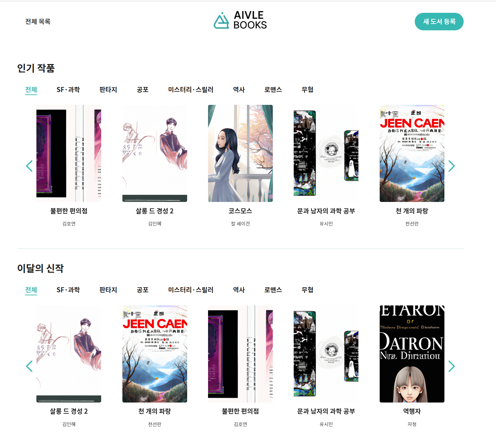
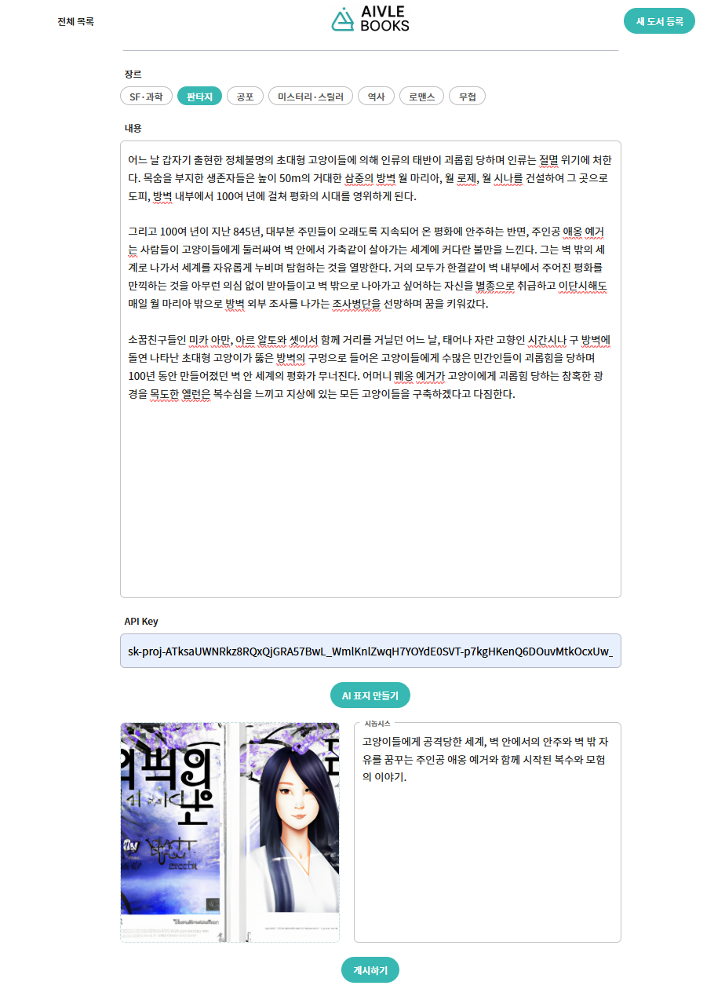
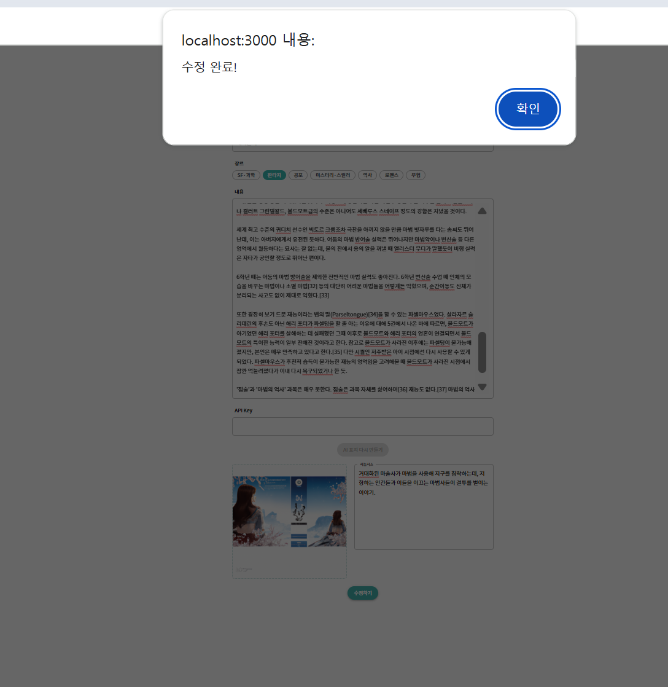
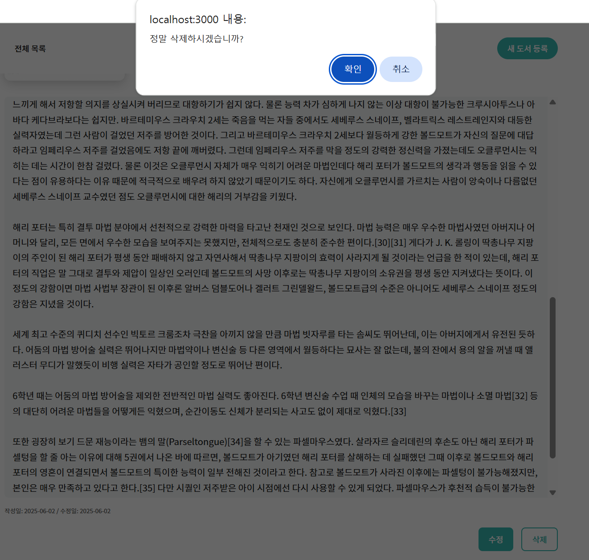
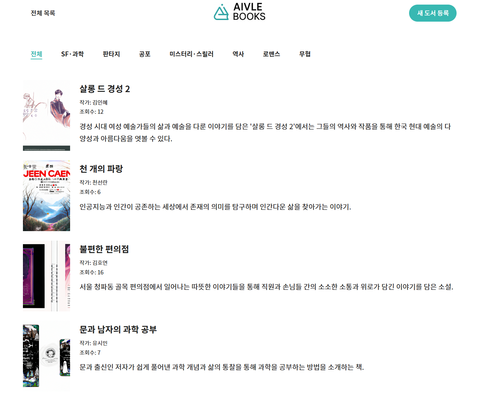

# Library Management System

Spring Boot와 React를 활용한 도서 관리 시스템입니다.  
도서 등록, 조회, 수정, 삭제 기능을 API 통신을 통해 구현하였으며, 팀 프로젝트로서 기획부터 구현까지의 과정을 포함합니다.

---

## 📁 프로젝트 구조
```
📁 Library_management/
├── Backend/                  # 백엔드 (Spring Boot)
├── frontend/                 # 프론트엔드 (React)
├── docs/                     # 발표자료 및 문서 파일
└── README.md                 # 프로젝트 설명서
```

📄 회의록 및 문서
* 20조 도서 관리 시스템 회의록 (Notion)

[20조 회의록 (Notion 링크)](https://www.notion.so/20-203b0c68be3980fba07dc9b8c789953f) – 프로젝트 중 회의 내용을 정리한 문서입니다.

---

## 🚀 주요 기능

- 도서 등록 / 조회 / 수정 / 삭제 (CRUD)
- 카테고리 기반 검색 및 필터링
- React와 Axios를 활용한 API 연동
- Spring Boot 기반 RESTful API 설계
- **GPT-3.5-turbo 기반 줄거리 요약 + DALL·E 2 기반 도서 표지 이미지 생성**

---

## 👥 팀원 및 역할

| 이름     | 역할              |
|----------|-------------------|
| 최진호   | 팀장, 백엔드 개발 |
| 황규희   | PPT 제작, 백엔드  |
| 조은형   | 서기, 백엔드 개발 |
| 송현정   | 시간 관리, 프론트 |
| 장우진   | 발표, 프론트      |
| 조하민   | PPT 제작, 프론트 |
| 최태환   | PPT 제작, 프론트 |

## ⚙️ 사용 기술

**Frontend**:  
- React, Axios, React Router, MUI (Material UI), CSS Modules

**Backend**:  
- Java 17, Spring Boot, Gradle, JPA  

**Database**:  
- H2 (인메모리 DB, 개발용)

**Tools**:  
- VSCode, IntelliJ, Postman, GitHub
  
---

## 🔧 Git 작업 규칙 요약

- 항상 push 전에 `git pull`로 최신 코드 동기화
- pull 후 에러 없이 동작하는지 확인
- 문제 없을 때만 자기 브랜치에 push

## 🌿 브랜치 전략

- 개인 브랜치 → `front` / `back` 브랜치 (팀원 간 합의 후 merge)  
- `front` / `back` → `main` 브랜치 (전체 팀원 합의 후 merge)

---

## 📦 프론트엔드 구성 요약

- React 기반의 싱글 페이지 애플리케이션 (SPA)
- 주요 라이브러리: Axios, React Router, MUI, CSS Modules
- 기능 요약:
  - 도서 목록 조회 및 상세 페이지 이동
  - 도서 등록 시 AI 서버 연동 → 줄거리 요약 + 표지 이미지 생성
- 상태 관리: `useState`, `useEffect`, `props` 기반
- 프록시 설정: `package.json`에 `"proxy": "http://localhost:8080"` 지정 → 백엔드 연동 자동화

---

## 📨 백엔드 구성 요약

- Java 17, Spring Boot 3.x 기반
- Gradle 프로젝트, JPA + H2 Database 사용 (개발용 인메모리 DB)
- Entity, DTO, Repository, Service, Controller 계층 분리
- RESTful API 설계 및 구현:
  - `POST /api/books` → 도서 등록
  - `GET /api/books` → 도서 목록 조회
  - `GET /api/books/{id}` → 상세 조회
  - `PUT /api/books/{id}` → 도서 수정
  - `DELETE /api/books/{id}` → 도서 삭제
  - `POST /api/books/generate-cover` → GPT 기반 줄거리 요약 + 이미지 생성
  - `POST /api/books/{id}/generate-cover` → 기존 도서 기반 이미지 재생성
- API 응답: JSON 기반, 프론트엔드와 직관적 연동 가능

---

## ▶️ 실행 방법

### 백엔드 실행
```bash
cd Backend
./gradlew bootRun
```

### 프론트엔드 실행

```bash
cd frontend
yarn install
yarn start
```

---

## 🖼️ 서비스 화면 예시

### 1. 메인 도서 목록 페이지
사용자가 전체 도서를 조회하고, 인기 도서 및 신작을 확인할 수 있는 첫 화면입니다.




### 2. 도서 등록 화면
도서 제목, 작가, 장르, 줄거리 입력과 함께 AI 요약 및 표지 이미지 생성을 요청할 수 있습니다.




### 3. 도서 수정 화면
기존 도서 정보를 불러온 뒤 내용을 수정할 수 있으며, 수정 완료 시 알림이 표시됩니다.




### 4. 도서 삭제 확인
삭제 버튼 클릭 시 사용자 확인을 요구하는 팝업이 출력됩니다.




### 5. 탭 기반 필터링 (장르별 탐색)
장르 탭을 클릭하여 카테고리별 도서를 필터링할 수 있는 기능입니다.



---

## 🏁 프로젝트 결과 및 성과

### 최종 구현 결과
- **전체 기능 구현 완료**: CRUD, 카테고리 필터, AI 연동 기능 모두 작동
- **AI 기능 통합 성공**: GPT-3.5-turbo와 DALL·E 2를 활용한 줄거리 요약 및 표지 이미지 자동 생성
- **프론트-백엔드 완전 통신 확인**: 로컬 환경 기준 정상 작동 확인
- **Postman 및 브라우저 기반 테스트 완료**


### 협업 성과
- 팀원 간 역할 분담이 명확했고, 일정 내 완성도 높은 결과물 도출
- 백엔드 ↔ 프론트 간 인터페이스 협의 및 연동 경험 축적
- 깃 브랜치 전략을 기반으로 충돌 없이 안정적인 협업 완료

### 회고 및 배운 점
- 실서비스를 목표로 한 **풀스택 구조에 대한 이해** 향상
- AI API 연동 시 발생하는 **비동기 처리와 예외 처리** 경험
- 협업 중 발생한 충돌, 커뮤니케이션 오류를 직접 해결하며 실전 대응력 강화

